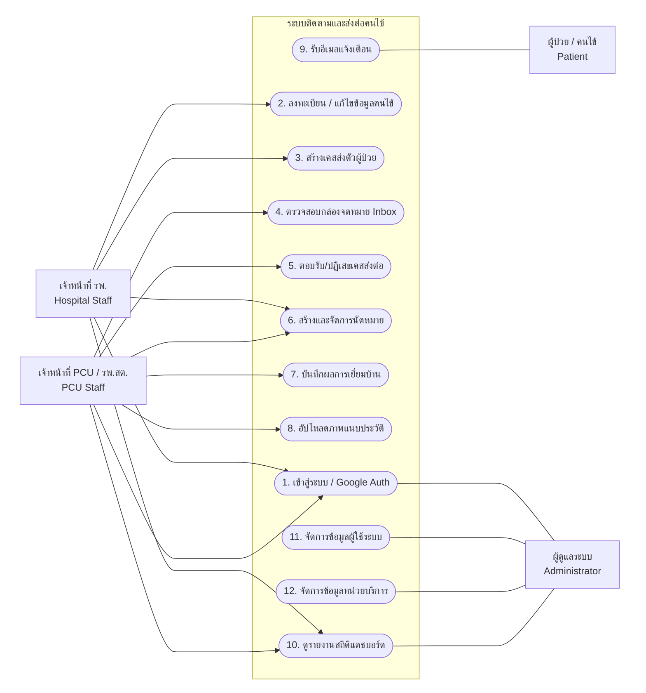
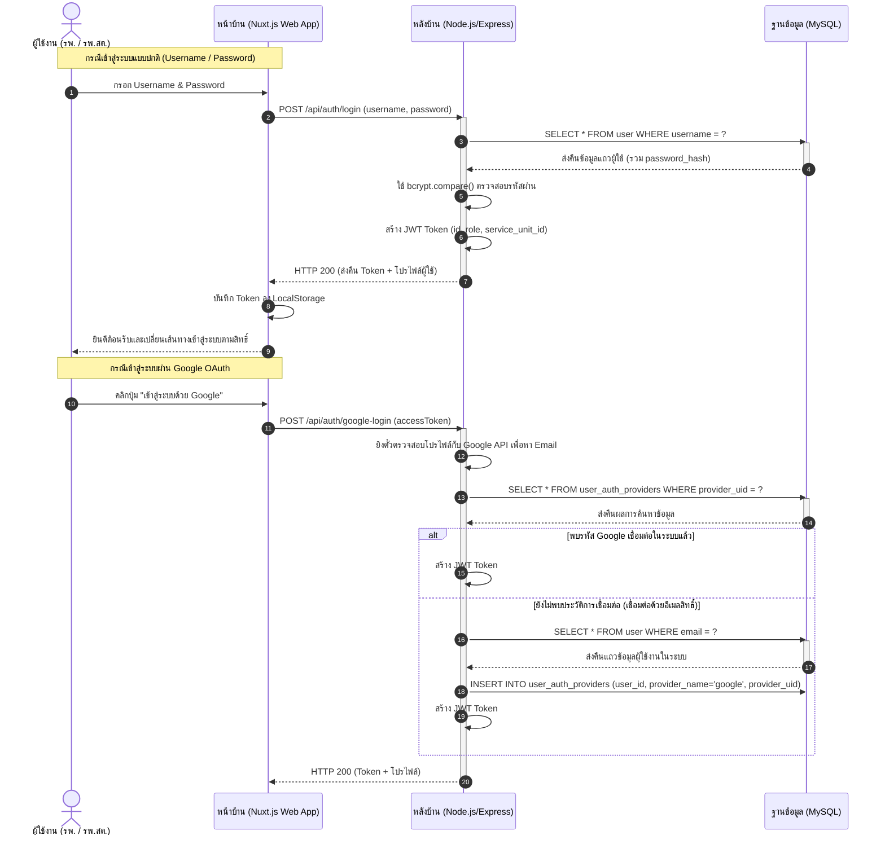
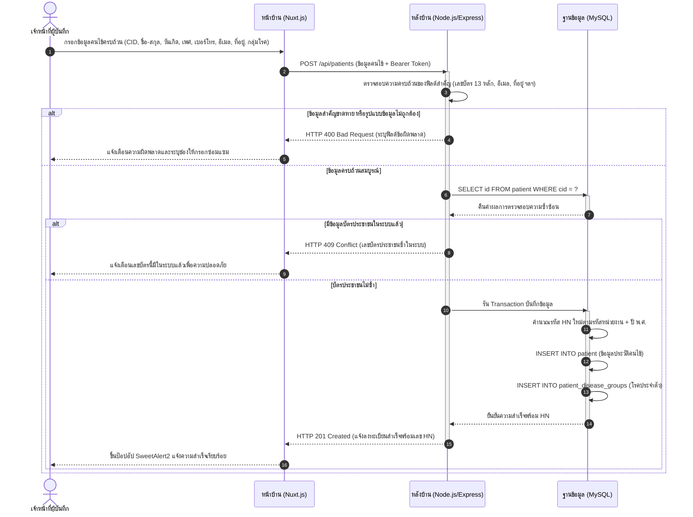
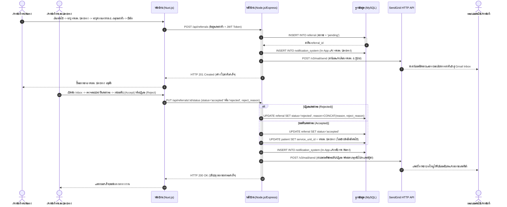
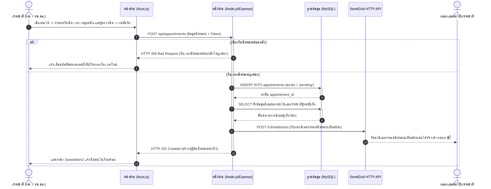
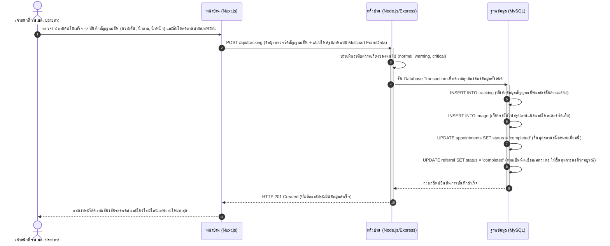
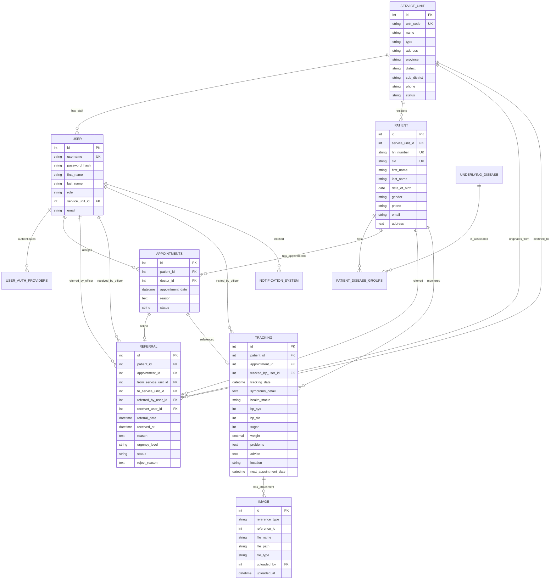

# คู่มือวิเคราะห์และออกแบบระบบ (Senior Project System Analysis & Design Guide)
> [!NOTE]
> เอกสารฉบับนี้จัดทำขึ้นเพื่อสำหรับนำไปใช้ประกอบรายงานความก้าวหน้าโครงการฝึกงาน หรือเล่มวิจัยจบการศึกษา (Senior Project) ปีที่ 4 โดยอิงตามระบบจริงของ **Patient Tracking System (ระบบติดตามและส่งต่อคนไข้)** ที่ได้รับการพัฒนาในองค์กร

---

## 1. ยูสเคสไดอะแกรม (Use Case Diagram)
ระบบติดตามและส่งต่อคนไข้ (Patient Tracking System) จะประกอบไปด้วยการทำงานของระบบ (Use Case) และปัจจัยที่เกี่ยวข้องภายนอก (Actor) มีรายละเอียดดังนี้

1. **ปัจจัยที่เกี่ยวข้องภายนอก (Actor)** จะเป็นบทบาทของผู้ใช้ที่ทำงานกับระบบ ในยูสเคสนี้มี 4 บทบาท คือ:
   * เจ้าหน้าที่โรงพยาบาล (Hospital Staff)
   * เจ้าหน้าที่อนามัย / รพ.สต. (PCU Staff)
   * ผู้ป่วย (Patient)
   * ผู้ดูแลระบบ (Administrator / Manager)

2. **การทำงานของระบบ (Use Case)** มี 4 ส่วนตามบทบาทผู้ใช้งาน โดยมีทั้งหมด 19 ยูสเคส ดังนี้:
   * **2.1 เจ้าหน้าที่โรงพยาบาล (Hospital Staff)** มี 7 ยูสเคส คือ:
     * 2.1.1 เข้าสู่ระบบด้วยบัญชีผู้ใช้งาน (Login)
     * 2.1.2 ลงทะเบียนประวัติคนไข้ใหม่ (Register Patient)
     * 2.1.3 แก้ไขข้อมูลคนไข้ในระบบ (Update Patient)
     * 2.1.4 สร้างเคสส่งต่อการติดตามผู้ป่วยไปยังอนามัยปลายทาง (Create Referral)
     * 2.1.5 สร้างและจัดการปฏิทินนัดหมายเยี่ยมบ้านของคนไข้ (Create Appointment)
     * 2.1.6 ดูประวัติการรักษา การส่งต่อ และการติดตามเยี่ยมบ้านย้อนหลังของคนไข้ (View Patient History)
     * 2.1.7 ดูรายงานสถิติตัวเลขภาพรวมบนแดชบอร์ดหลัก (View Dashboard)
   * **2.2 เจ้าหน้าที่อนามัย / รพ.สต. (PCU Staff)** มี 7 ยูสเคส คือ:
     * 2.2.1 เข้าสู่ระบบด้วยบัญชีผู้ใช้งาน (Login)
     * 2.2.2 ดูข้อมูลเคสส่งตัวทั้งหมดในกล่องจดหมายเข้า (View Referral Inbox)
     * 2.2.3 ตอบรับหรือปฏิเสธเคสส่งต่อพร้อมระบุเหตุผลประกอบ (Accept or Reject Referral Cases)
     * 2.2.4 บันทึกประวัติสัญญาณชีพและผลการลงพื้นที่ติดตามเยี่ยมบ้านคนไข้ (Record Home Tracking/Visit)
     * 2.2.5 บันทึกรูปภาพสภาพแวดล้อมบ้านและการจัดยาแนบประกอบรายงาน (Upload Home Visit Images)
     * 2.2.6 ดูและจัดการปฏิทินนัดหมายสำหรับเยี่ยมบ้านของคนไข้ที่รับดูแล (View and Manage Appointments)
     * 2.2.7 ดูรายงานสถิติและข้อมูลบนแดชบอร์ดเฉพาะหน่วยงานของตน (View PCU Dashboard)
   * **2.3 ผู้ป่วย / คนไข้ (Patient)** มี 2 ยูสเคส คือ:
     * 2.3.1 รับอีเมลแจ้งเตือนอัตโนมัติเมื่อโรงพยาบาลสร้างเคสส่งตัว (Receive Referral Notification Email)
     * 2.3.2 รับอีเมลแจ้งนัดหมายการลงพื้นที่เยี่ยมบ้าน และดูรายละเอียดนัดหมายผ่านตู้จดหมายอีเมล (Receive Appointment Notification Email)
   * **2.4 ผู้ดูแลระบบ / ผู้จัดการ (Administrator / Manager)** มี 3 ยูสเคส คือ:
     * 2.4.1 จัดการข้อมูลบัญชีผู้ใช้งานระบบและระดับสิทธิ์ของเจ้าหน้าที่ (Manage Users & Roles)
     * 2.4.2 จัดการข้อมูลรายชื่อโรงพยาบาลและอนามัย รพ.สต. ในฐานข้อมูล (Manage Service Units)
     * 2.4.3 เรียกดูรายงานสรุปสถิติตัวเลขการส่งต่อในภาพรวมของระบบทั้งหมด (View System Analytics and Overall Reports)

---

### แผนภาพ Use Case Diagram

---

## 2. ซีนาริโอ (Scenario) ขอบเขตบทบาทผู้ใช้ระบบ
ระบบติดตามและส่งต่อคนไข้ (Patient Tracking System) ประกอบด้วยผู้ใช้งานระบบหลัก ได้แก่ **เจ้าหน้าที่โรงพยาบาล (Hospital Staff)**, **เจ้าหน้าที่อนามัย / รพ.สต. (PCU Staff)**, **ผู้ดูแลระบบ (Administrator / Manager)** และ **ผู้ป่วย (Patient)** ซึ่งมีบทบาทในการทำงานที่เกี่ยวข้องกับระบบ ดังนี้:

### 2.1 เจ้าหน้าที่โรงพยาบาล (Hospital Staff)
*   เจ้าหน้าที่โรงพยาบาล สามารถเข้าสู่ระบบด้วยบัญชีผู้ใช้งานทั่วไป (Login)
*   เจ้าหน้าที่โรงพยาบาล สามารถลงทะเบียนประวัติคนไข้ใหม่ (Register Patient) โดยกรอกข้อมูล CID, ชื่อ-นามสกุล, วันเกิด, เพศ, เบอร์โทร, อีเมล, ที่อยู่ และโรคประจำตัวครบถ้วน
*   เจ้าหน้าที่โรงพยาบาล สามารถแก้ไขข้อมูลคนไข้ในระบบ (Update Patient)
*   เจ้าหน้าที่โรงพยาบาล สามารถสร้างเคสส่งต่อการติดตามผู้ป่วยไปยังอนามัยปลายทาง (Create Referral)
*   เจ้าหน้าที่โรงพยาบาล สามารถสร้างและจัดการปฏิทินนัดหมายเยี่ยมบ้านของคนไข้ (Create Appointment)
*   เจ้าหน้าที่โรงพยาบาล สามารถดูประวัติการรักษา การส่งต่อ และการติดตามเยี่ยมบ้านย้อนหลังของคนไข้ (View Patient History)
*   เจ้าหน้าที่โรงพยาบาล สามารถดูรายงานสถิติตัวเลขภาพรวมบนแดชบอร์ดหลัก (View Dashboard)

### 2.2 เจ้าหน้าที่อนามัย / รพ.สต. (PCU Staff)
*   เจ้าหน้าที่อนามัย สามารถเข้าสู่ระบบด้วยบัญชีผู้ใช้งานทั่วไป (Login)
*   เจ้าหน้าที่อนามัย สามารถดูข้อมูลเคสส่งตัวทั้งหมดที่ส่งเข้ามายังหน่วยบริการของตนในกล่องจดหมายเข้า (View Referral Inbox)
*   เจ้าหน้าที่อนามัย สามารถตอบรับหรือปฏิเสธเคสส่งต่อพร้อมบันทึกเหตุผลประกอบ (Accept or Reject Referral Cases)
*   เจ้าหน้าที่อนามัย สามารถบันทึกประวัติสัญญาณชีพและผลการลงพื้นที่ติดตามเยี่ยมบ้านคนไข้ (Record Home Tracking/Visit)
*   เจ้าหน้าที่อนามัย สามารถบันทึกรูปภาพสภาพแวดล้อมบ้านและการจัดยาแนบประกอบรายงาน (Upload Home Visit Images)
*   เจ้าหน้าที่อนามัย สามารถเลือกส่งตัวกลับโรงพยาบาลแม่ข่ายเดิม (Refer Back) ทันทีในระหว่างบันทึกผลการติดตาม หากพบภาวะแทรกซ้อนรุนแรง
*   เจ้าหน้าที่อนามัย สามารถดูและจัดการปฏิทินนัดหมายสำหรับเยี่ยมบ้านของคนไข้ที่รับดูแล (View and Manage Appointments)
*   เจ้าหน้าที่อนามัย สามารถดูรายงานสถิติและข้อมูลบนแดชบอร์ดเฉพาะหน่วยงานของตน (View PCU Dashboard)

### 2.3 ผู้ป่วย / คนไข้ (Patient)
*   ผู้ป่วย สามารถรับอีเมลแจ้งเตือนอัตโนมัติเมื่อโรงพยาบาลสร้างเคสส่งตัว (Receive Referral Notification Email)
*   ผู้ป่วย สามารถรับอีเมลแจ้งนัดหมายการลงพื้นที่เยี่ยมบ้าน และดูรายละเอียดนัดหมายผ่านตู้จดหมายอีเมล (Receive Appointment Notification Email)

### 2.4 ผู้ดูแลระบบ / ผู้จัดการ (Administrator / Manager)
*   ผู้ดูแลระบบ สามารถจัดการข้อมูลบัญชีผู้ใช้งานระบบและระดับสิทธิ์ของเจ้าหน้าที่ (Manage Users & Roles)
*   ผู้ดูแลระบบ สามารถจัดการข้อมูลรายชื่อโรงพยาบาลและอนามัย รพ.สต. ในฐานข้อมูล (Manage Service Units)
*   ผู้ดูแลระบบ สามารถเรียกดูรายงานสรุปสถิติตัวเลขการส่งต่อในภาพรวมของระบบทั้งหมด (View System Analytics and Overall Reports)

---

## 3. Use Case Specification (ตารางอธิบายรายละเอียด)
คำอธิบายขั้นตอนการทำงานอย่างเป็นระบบของ 3 ระบบหลักตามขอบเขตงาน

### UC-01: ระบบลงทะเบียนคนไข้ใหม่ (Patient Registration System)
| หัวข้อ | รายละเอียด |
| :--- | :--- |
| **รหัส Use Case** | UC-01 |
| **ชื่อ Use Case** | การลงทะเบียนข้อมูลคนไข้ใหม่ (Patient Registration) |
| **Actor หลัก** | Hospital Staff (เจ้าหน้าที่ รพ.) / PCU Staff (เจ้าหน้าที่ รพ.สต.) |
| **คำอธิบาย** | เจ้าหน้าที่กรอกข้อมูลส่วนตัวของคนไข้เข้าระบบ โดยต้องระบุข้อมูลสำคัญให้ครบถ้วนจึงจะบันทึกสำเร็จ |
| **เงื่อนไขก่อนหน้า (Pre-conditions)** | 1. เจ้าหน้าที่ล็อกอินเข้าสู่ระบบเรียบร้อยแล้ว 2. เจ้าหน้าที่มีสิทธิ์ในการสร้าง/แก้ไขประวัติผู้ป่วย |
| **เงื่อนไขหลังจบ (Post-conditions)** | 1. ระบบบันทึกข้อมูลผู้ป่วยใหม่ลงตาราง `patient` 2. ข้อมูลกลุ่มโรคประจำตัวจับคู่ลงตาราง `patient_disease_groups` เพื่อใช้คัดกรองความเสี่ยง |
| **ขั้นตอนการทำงานหลัก (Main Flow)** | 1. เจ้าหน้าที่เลือกเมนู "ลงทะเบียนคนไข้ใหม่" บนระบบหน้าบ้าน 2. เจ้าหน้าที่ต้องระบุข้อมูลทุกฟิลด์ให้ครบถ้วน ได้แก่: &nbsp;&nbsp;&nbsp;&nbsp;- เลขบัตรประชาชน (CID) 13 หลัก &nbsp;&nbsp;&nbsp;&nbsp;- ชื่อจริง และ นามสกุล &nbsp;&nbsp;&nbsp;&nbsp;- วัน/เดือน/ปีเกิด &nbsp;&nbsp;&nbsp;&nbsp;- เพศ &nbsp;&nbsp;&nbsp;&nbsp;- เบอร์โทรศัพท์ &nbsp;&nbsp;&nbsp;&nbsp;- อีเมลแจ้งเตือน (รูปแบบถูกต้อง) &nbsp;&nbsp;&nbsp;&nbsp;- ที่อยู่โดยละเอียดสำหรับการเยี่ยมบ้าน &nbsp;&nbsp;&nbsp;&nbsp;- กลุ่มโรคประจำตัวอย่างน้อย 1 กลุ่มโรค 3. เจ้าหน้าที่ตรวจสอบความถูกต้องและกดปุ่ม "บันทึกข้อมูล" 4. ระบบหน้าบ้านและระบบหลังบ้านทำการตรวจสอบ (Validate) ทุกช่องข้อมูลตามเงื่อนไขที่กำหนด 5. ระบบตรวจสอบว่าเลขบัตรประชาชน (CID) หรือเลข HN ซ้ำกับคนไข้รายอื่นในระบบหรือไม่ 6. ระบบรัน Database Transaction เพื่อบันทึกข้อมูลตาราง `patient` และตาราง `patient_disease_groups` 7. หน้าจอแจ้งเตือนข้อความสำเร็จ "ลงทะเบียนผู้ป่วยสำเร็จ" และแสดงเลข HN ที่สร้างขึ้นใหม่ |
| **ขั้นตอนสลับ (Alternative Flow)** | **[กรณีข้อมูลสำคัญไม่ครบถ้วนหรือรูปแบบไม่ถูกต้อง]** 4a. หากตรวจพบว่าฟิลด์ใดฟิลด์หนึ่งว่างเปล่า หรือรูปแบบอีเมลไม่ถูกต้อง ระบบหลังบ้านจะปฏิเสธการบันทึก (Return HTTP 400 Bad Request) และแสดงแจ้งเตือนฟิลด์ที่ต้องการแก้ไข **[กรณีเลขบัตรประชาชน (CID) ซ้ำซ้อน]** 5a. หากตรวจพบว่ามี CID นี้ในฐานข้อมูลแล้ว ระบบจะยกเลิก Transaction (Return HTTP 409 Conflict) และแจ้งเตือนข้อผิดพลาดบัตรประชาชนซ้ำ |

---

### UC-02: ระบบนัดหมายเยี่ยมบ้าน (Appointment Scheduling System)
| หัวข้อ | รายละเอียด |
| :--- | :--- |
| **รหัส Use Case** | UC-02 |
| **ชื่อ Use Case** | การนัดหมายเพื่อเยี่ยมบ้านและติดตามอาการ (Appointment Scheduling) |
| **Actor หลัก** | Hospital Staff (เจ้าหน้าที่ รพ.) / PCU Staff (เจ้าหน้าที่ รพ.สต.) |
| **คำอธิบาย** | เจ้าหน้าที่นัดหมายวัน เวลา และกำหนดเหตุผลในการลงพื้นที่ตรวจสุขภาพหรือเยี่ยมบ้านคนไข้ |
| **เงื่อนไขก่อนหน้า (Pre-conditions)** | 1. คนไข้ได้รับการลงทะเบียนเข้าระบบเป็นที่เรียบร้อยแล้ว |
| **เงื่อนไขหลังจบ (Post-conditions)** | 1. ระบบบันทึกข้อมูลงตาราง `appointments` ในสถานะรอนัดหมาย (`pending`)  2. ระบบส่งอีเมลแจ้งเตือนนัดหมายไปยังผู้ป่วยและเจ้าหน้าที่ผู้ดูแลโดยอัตโนมัติ |
| **ขั้นตอนการทำงานหลัก (Main Flow)** | 1. เจ้าหน้าที่เปิดหน้าข้อมูลคนไข้ที่ต้องการนัดหมาย 2. เจ้าหน้าที่เลือกเมนู "สร้างนัดหมาย" 3. เจ้าหน้าที่กรอกข้อมูล: วันและเวลานัดหมาย, แพทย์/เจ้าหน้าที่ผู้รับผิดชอบนัดหมาย, และรายละเอียดวัตถุประสงค์ในการเข้าเยี่ยม 4. เจ้าหน้าที่กดปุ่ม "บันทึกนัดหมาย" 5. ระบบตรวจสอบข้อมูลและทำการเขียนบันทึกลงตาราง `appointments` ในรูปแบบสถานะ `pending` 6. หลังการบันทึกสำเร็จ ระบบดึงข้อมูลอีเมลผู้เกี่ยวข้องและยิง HTTP Request ไปยัง SendGrid API เพื่อส่งอีเมลนัดหมายอัตโนมัติ 7. หน้าจอปรากฏหน้าต่างแจ้งเตือนสำเร็จ |
| **ขั้นตอนสลับ (Alternative Flow)** | **[กรณีเลือกวันนัดหมายย้อนหลัง]** 3a. ระบบตรวจสอบพบว่าวันนัดหมายมีค่าน้อยกว่าวันเวลาปัจจุบัน จะแสดงหน้าจอแจ้งเตือนความผิดพลาด และไม่อนุญาตให้ผ่านขั้นตอนบันทึก |

---

### UC-03: ระบบส่งต่อและติดตาม (Referral and Tracking System)
| หัวข้อ | รายละเอียด |
| :--- | :--- |
| **รหัส Use Case** | UC-03 |
| **ชื่อ Use Case** | การส่งต่อผู้ป่วยและติดตามประเมินผลเยี่ยมบ้าน (Patient Referral & Tracking) |
| **Actor หลัก** | Hospital Staff (เจ้าหน้าที่ รพ. ผู้ส่งต่อ) / PCU Staff (เจ้าหน้าที่ รพ.สต. ผู้รับและติดตาม) |
| **คำอธิบาย** | กระบวนการส่งต่อผู้ป่วยพ้นระยะวิกฤตจาก รพ. ไปให้ รพ.สต.ดูแลต่อ โดย รพ.สต.จะรับเคสและบันทึกประวัติสัญญาณชีพที่ได้จากการลงเยี่ยมบ้าน |
| **เงื่อนไขก่อนหน้า (Pre-conditions)** | 1. ผู้ป่วยได้รับการจดทะเบียนในระบบ 2. ได้รับการวินิจฉัยและมีคำสั่งส่งต่อการดูแลสุขภาพ |
| **เงื่อนไขหลังจบ (Post-conditions)** | 1. สถานะใบส่งต่อ (`referral`) และนัดหมาย (`appointments`) ได้รับการปรับเป็น `completed` 2. บันทึกผลวัดสุขภาพลงตาราง `tracking` และรูปถ่ายแนบลงตาราง `image` เรียบร้อย |
| **ขั้นตอนการทำงานหลัก (Main Flow)** | 1. **[รพ. ส่งตัว]**: เจ้าหน้าที่ รพ. สร้างเคสส่งตัวผู้ป่วย ➡️ เลือก รพ.สต. ปลายทางระบุความเร่งด่วน ➡️ บันทึกข้อมูลและส่งอีเมลแจ้งอนามัยปลายทางอัตโนมัติ 2. **[รพ.สต. ตอบรับ]**: เจ้าหน้าที่ รพ.สต. ตรวจสอบประวัติใน Inbox และกดยอมรับ (Accept) ➡️ ระบบสร้างประวัตินัดหมายอ้างอิงอัตโนมัติ 3. **[รพ.สต. บันทึกติดตาม]**: เมื่อเจ้าหน้าที่เดินทางไปตรวจคนไข้จริงเสร็จ จะมาเปิดหน้าต่าง "บันทึกผลการติดตาม" ➡️ ระบุสัญญาณชีพ (ความดันโลหิต SYS/DIA, ค่าน้ำตาล DTX, น้ำหนักตัว, อาการ และปัญหาสภาพแวดล้อมพร้อมแนบภาพถ่าย) 4. เจ้าหน้าที่กดบันทึกผลการเยี่ยมบ้าน 5. ระบบใช้ Transaction ทำการบันทึกตาราง `tracking` และ `image` พร้อมเปลี่ยนสถานะนัดหมายและใบส่งต่อเดิมให้กลายเป็น `completed` ทันที 6. หน้าจอปรากฏแจ้งเตือนบันทึกผลสำเร็จ |
| **ขั้นตอนสลับ (Alternative Flow)** | **[กรณีปฏิเสธเคสส่งต่อ]** 2a. หากตรวจสอบพบว่าผู้ป่วยไม่ได้อยู่ในเขตรับผิดชอบของอนามัยนั้น เจ้าหน้าที่ รพ.สต. กด "ปฏิเสธ" (Reject) พร้อมบันทึกเหตุผล ➡️ ระบบส่งอีเมลแจ้งกลับไปที่ รพ. เพื่อหาแนวทางส่งตัวต่อที่อื่น **[กรณีพบสัญญาณชีพเสี่ยงอันตราย]** 5a. หากข้อมูลความดันโลหิตหรือน้ำตาลอยู่ในเกณฑ์วิกฤต (Critical) ระบบจะขึ้นป๊อปอัปแจ้งเตือนให้เจ้าหน้าที่ประสานงานเพื่อส่งตัวผู้ป่วยกลับโรงพยาบาลใหญ่อย่างเร่งด่วน **[กรณีส่งกลับรักษาต่อ (Refer Back)]** 5b. ในขั้นตอนกรอกผลการติดตาม หากตรวจพบอาการแทรกซ้อนรุนแรง รพ.สต. สามารถเลือก "ส่งตัวกลับโรงพยาบาลด่วน (Refer Back)" ➡️ ระบบจะรันคำสั่งโอนย้ายสังกัดหลักของคนไข้กลับคืนโรงพยาบาลแม่ข่ายเดิมทันที พร้อมทั้งสร้างใบส่งตัวแถวใหม่สถานะ pending ระดับความเร่งด่วนสูงสุด (urgent) และยิงอีเมลพร้อม In-App แจ้งเตือนแผนก ER/ศูนย์ส่งต่อของ รพ. ปลายทางโดยอัตโนมัติ |

---

## 3. Flow Chart (แผนผังลำดับขั้นตอนการทำงาน / Workflow)
แผนภูมิแสดง Flow การทำงานเชิงธุรกิจของกระบวนการส่งต่อและการติดตามเยี่ยมนัดหมายตั้งแต่ต้นจนจบกระบวนการ

---

## 4. Sequence Diagram (แผนภาพลำดับขั้นการทำงานของระบบ)
แสดงการแลกเปลี่ยนข้อมูลระหว่างส่วนประกอบต่างๆ ของระบบย่อยทั้งหมดในระบบจริง เช่น ระบบยืนยันตัวตน, ลงทะเบียนผู้ป่วย, ระบบส่งต่อผู้ป่วย, สร้างนัดหมาย และการติดตามประเมินเยี่ยมบ้าน

### 4.1 ระบบเข้าสู่ระบบยืนยันตัวตน (Authentication & Authorization System)

---

### 4.2 ระบบลงทะเบียนคนไข้ใหม่และระบบตรวจสอบข้อมูล (Patient Registration & Validation System)

---

### 4.3 ระบบส่งต่อผู้ป่วยและการจัดการสถานะ (Patient Referral System)

---

### 4.4 ระบบนัดหมายเยี่ยมบ้าน (Appointment Scheduling System)

---

### 4.5 ระบบบันทึกผลการติดตามเยี่ยมบ้าน (Home Visit Tracking System)

---

## 5. ER Diagram (Entity-Relationship Diagram)
โครงสร้างความสัมพันธ์ระหว่างข้อมูลในฐานข้อมูล MySQL จริงของระบบ โดยระบุ Primary Key (PK) และ Foreign Key (FK) ตามที่ใช้จริงในสถาปัตยกรรมระบบ

---

## 6. Data Dictionary (พจนานุกรมข้อมูล)
โครงสร้างฟิลด์ข้อมูลอย่างละเอียดของตารางที่สำคัญเพื่อสำหรับใส่ในเอกสารบทที่ 3 ของเล่มรายงานตามรูปแบบมาตรฐานวิชาการ

### ตารางที่ 1: `patient` (ข้อมูลคนไข้)
เก็บรายละเอียดประวัติข้อมูลส่วนตัวของคนไข้ที่รับการส่งตัวหรือนัดหมาย

| No. | Field Name | Type | Length | Format | Description | Constraint |
| :---: | :--- | :--- | :---: | :--- | :--- | :--- |
| 1 | id | int | 11 | ตัวเลข | ไอดีลำดับข้อมูลผู้ป่วย (รหัสภายใน) | Primary key |
| 2 | service_unit_id | int | 11 | ตัวเลข | รหัสอ้างอิงหน่วยบริการที่แรกรับ | Foreign key |
| 3 | hn_number | varchar | 50 | ตัวอักษร | หมายเลขประจำตัวผู้ป่วย (HN) | Unique key |
| 4 | cid | varchar | 13 | ตัวอักษร | เลขประจำตัวประชาชน 13 หลัก | Unique key |
| 5 | first_name | varchar | 100 | ตัวอักษร | ชื่อจริงผู้ป่วย (ภาษาไทย) | Not Null |
| 6 | last_name | varchar | 100 | ตัวอักษร | นามสกุลผู้ป่วย (ภาษาไทย) | Not Null |
| 7 | date_of_birth | date | 0 | วันที่ | วัน/เดือน/ปีเกิดของผู้ป่วย | Not Null |
| 8 | gender | varchar | 10 | ตัวอักษร | เพศของผู้ป่วย | Not Null |
| 9 | phone | varchar | 20 | ตัวอักษร | เบอร์โทรศัพท์ติดต่อของผู้ป่วยหรือญาติ | Null |
| 10 | email | varchar | 255 | ตัวอักษร | อีเมลสำหรับการส่งแจ้งเตือน | Null |
| 11 | address | text | 0 | ตัวอักษร | ที่อยู่สำหรับการลงพื้นที่เยี่ยมบ้าน | Null |

---

### ตารางที่ 2: `referral` (ประวัติการส่งต่อผู้ป่วย)
ใช้สำหรับจัดเก็บข้อมูลและประวัติการส่งเคสจากโรงพยาบาลไปยัง รพ.สต.

| No. | Field Name | Type | Length | Format | Description | Constraint |
| :---: | :--- | :--- | :---: | :--- | :--- | :--- |
| 1 | id | int | 11 | ตัวเลข | ไอดีลำดับข้อมูลการส่งตัว | Primary key |
| 2 | patient_id | int | 11 | ตัวเลข | รหัสผู้ป่วยที่ถูกส่งต่อ | Foreign key |
| 3 | appointment_id | int | 11 | ตัวเลข | รหัสการนัดหมายเยี่ยมบ้านที่เชื่อมโยง | Foreign key (Null) |
| 4 | from_service_unit_id | int | 11 | ตัวเลข | รหัสหน่วยงานผู้ส่งต้นทาง | Foreign key |
| 5 | to_service_unit_id | int | 11 | ตัวเลข | รหัสหน่วยงานผู้รับปลายทาง | Foreign key |
| 6 | referred_by_user_id | int | 11 | ตัวเลข | รหัสเจ้าหน้าที่ผู้กดส่งตัว | Foreign key |
| 7 | receiver_user_id | int | 11 | ตัวเลข | รหัสเจ้าหน้าที่ผู้กดตอบรับเคส | Foreign key (Null) |
| 8 | referral_date | datetime | 0 | วันที่ | วันและเวลาที่ลงบันทึกส่งเคส | Not Null |
| 9 | received_at | datetime | 0 | วันที่ | วันและเวลาที่กดรับเคส | Null |
| 10 | reason | text | 0 | ตัวอักษร | เหตุผลทางการแพทย์หรืออาการสำหรับการส่งตัว | Null |
| 11 | urgency_level | varchar | 20 | ตัวอักษร | ระดับความเร่งด่วน (low, medium, high, critical) | Not Null |
| 12 | status | varchar | 20 | ตัวอักษร | สถานะเคส (pending, accepted, rejected, completed) | Not Null |
| 13 | reject_reason | text | 0 | ตัวอักษร | ระบุเหตุผลกรณีปลายทางกดปฏิเสธเคส | Null |

---

### ตารางที่ 3: `tracking` (ประวัติการเยี่ยมบ้าน/ติดตามคนไข้)
เก็บข้อมูลผลการตรวจประเมินระดับสัญญาณชีพและประวัติทางสุขภาพเมื่อลงพื้นที่เยี่ยมบ้าน

| No. | Field Name | Type | Length | Format | Description | Constraint |
| :---: | :--- | :--- | :---: | :--- | :--- | :--- |
| 1 | id | int | 11 | ตัวเลข | ไอดีลำดับประวัติการเยี่ยมบ้าน | Primary key |
| 2 | patient_id | int | 11 | ตัวเลข | รหัสคนไข้ที่ได้รับการติดตามประเมินผล | Foreign key |
| 3 | appointment_id | int | 11 | ตัวเลข | รหัสรอบนัดหมายเยี่ยมบ้านที่เชื่อมโยง | Foreign key (Null) |
| 4 | tracked_by_user_id | int | 11 | ตัวเลข | รหัสเจ้าหน้าที่ผู้ลงพื้นที่เยี่ยมบ้าน | Foreign key |
| 5 | tracking_date | datetime | 0 | วันที่ | วันและเวลาที่ลงพื้นที่จริง | Not Null |
| 6 | symptoms_detail | text | 0 | ตัวอักษร | รายละเอียดอาการและสุขภาพทางคลินิกทั่วไป | Null |
| 7 | health_status | varchar | 20 | ตัวอักษร | จำแนกความเสี่ยงคนไข้ (normal, warning, critical) | Not Null |
| 8 | bp_sys | int | 11 | ตัวเลข | ค่าความดันตัวบน (mmHg) | Null |
| 9 | bp_dia | int | 11 | ตัวเลข | ค่าความดันตัวล่าง (mmHg) | Null |
| 10 | sugar | int | 11 | ตัวเลข | ค่าน้ำตาลในเลือดจากปลายนิ้ว (mg/dL) | Null |
| 11 | weight | decimal | 5,2 | ทศนิยม | น้ำหนักตัวปัจจุบันของผู้ป่วย (กก.) | Null |
| 12 | problems | text | 0 | ตัวอักษร | อุปสรรค ปัญหาสภาพแวดล้อมหรือจิตใจที่พบ | Null |
| 13 | advice | text | 0 | ตัวอักษร | คำแนะนำพยาบาลหรือการใช้ยาที่มอบให้ | Null |
| 14 | location | varchar | 255 | ตัวอักษร | พิกัดหรือตำแหน่งที่อยู่อ้างอิง (GPS) | Null |
| 15 | next_appointment_date | datetime | 0 | วันที่ | วันและเวลานัดหมายเข้าเยี่ยมในรอบถัดไป | Null |

---

### ตารางที่ 4: `appointments` (การนัดหมายของคนไข้)
เก็บข้อมูลปฏิทินนัดหมายในการเยี่ยมบ้านหรือรับบริการสุขภาพ

| No. | Field Name | Type | Length | Format | Description | Constraint |
| :---: | :--- | :--- | :---: | :--- | :--- | :--- |
| 1 | id | int | 11 | ตัวเลข | รหัสการนัดหมาย | Primary key |
| 2 | patient_id | int | 11 | ตัวเลข | รหัสผู้ป่วย | Foreign key |
| 3 | doctor_id | int | 11 | ตัวเลข | รหัสแพทย์/เจ้าหน้าที่ผู้นัดหมาย | Foreign key |
| 4 | appointment_date | datetime | 0 | วันที่ | วันและเวลานัดหมาย | Not Null |
| 5 | reason | text | 0 | ตัวอักษร | เหตุผลการนัดหมาย | Null |
| 6 | status | varchar | 20 | ตัวอักษร | สถานะการนัดหมาย (pending, completed, missed, cancelled) | Not Null |

---

### ตารางที่ 5: `user` (ผู้ใช้ระบบ/เจ้าหน้าที่ปฏิบัติงาน)
จัดเก็บรายละเอียดโปรไฟล์และระดับสิทธิ์การทำงานของบุคลากรในระบบ

| No. | Field Name | Type | Length | Format | Description | Constraint |
| :---: | :--- | :--- | :---: | :--- | :--- | :--- |
| 1 | id | int | 11 | ตัวเลข | รหัสอ้างอิงของเจ้าหน้าที่ | Primary key |
| 2 | username | varchar | 100 | ตัวอักษร | ชื่อบัญชีผู้ใช้งานระบบ | Unique key |
| 3 | password_hash | varchar | 255 | ตัวอักษร | รหัสผ่านที่เข้ารหัสความปลอดภัยด้วย bcrypt | Not Null |
| 4 | first_name | varchar | 100 | ตัวอักษร | ชื่อจริงเจ้าหน้าที่ | Not Null |
| 5 | last_name | varchar | 100 | ตัวอักษร | นามสกุลเจ้าหน้าที่ | Not Null |
| 6 | role | varchar | 50 | ตัวอักษร | ระดับสิทธิ์ (admin, manager, hospital_staff, pcu_staff) | Not Null |
| 7 | service_unit_id | int | 11 | ตัวเลข | รหัสหน่วยงานที่สังกัดปฏิบัติงาน | Foreign key (Null) |
| 8 | email | varchar | 255 | ตัวอักษร | อีเมลติดต่อรับแจ้งเตือนระบบงาน | Null |

---

### ตารางที่ 6: `service_unit` (ข้อมูลหน่วยงาน/โรงพยาบาล/รพ.สต.)
จัดเก็บรายละเอียดและรหัสหน่วยบริการสาธารณสุขในเครือข่าย

| No. | Field Name | Type | Length | Format | Description | Constraint |
| :---: | :--- | :--- | :---: | :--- | :--- | :--- |
| 1 | id | int | 11 | ตัวเลข | รหัสอ้างอิงหน่วยงานบริการ | Primary key |
| 2 | unit_code | varchar | 50 | ตัวอักษร | รหัสประจำหน่วยงาน (ใช้สร้างรหัส HN) | Unique key |
| 3 | name | varchar | 255 | ตัวอักษร | ชื่อโรงพยาบาลหรือ รพ.สต. (ภาษาไทย) | Not Null |
| 4 | type | varchar | 50 | ตัวอักษร | ประเภทหน่วยบริการ (เช่น Hospital, Health Center) | Not Null |
| 5 | address | varchar | 255 | ตัวอักษร | ที่ตั้งทางกายภาพของหน่วยงาน | Null |
| 6 | province | varchar | 100 | ตัวอักษร | จังหวัดที่สังกัด | Null |
| 7 | district | varchar | 100 | ตัวอักษร | อำเภอ/เขตที่สังกัด | Null |
| 8 | sub_district | varchar | 100 | ตัวอักษร | ตำบล/แขวงที่สังกัด | Null |
| 9 | phone | varchar | 20 | ตัวอักษร | เบอร์โทรศัพท์ติดต่อของหน่วยงาน | Null |
| 10 | status | varchar | 20 | ตัวอักษร | สถานะการทำงาน (Active, Inactive) | Not Null |

---

### ตารางที่ 7: `user_auth_providers` (การยืนยันตัวตนภายนอก / Google Auth)
เก็บรายละเอียดการเชื่อมโยงบัญชี Google OAuth เข้ากับบัญชีผู้ใช้ระบบ

| No. | Field Name | Type | Length | Format | Description | Constraint |
| :---: | :--- | :--- | :---: | :--- | :--- | :--- |
| 1 | id | int | 11 | ตัวเลข | รหัสอ้างอิงลำดับประวัติการเชื่อมโยง | Primary key |
| 2 | user_id | int | 11 | ตัวเลข | รหัสเจ้าหน้าที่ผู้ผูกบัญชี | Foreign key |
| 3 | provider_name | varchar | 50 | ตัวอักษร | ชื่อผู้ให้บริการยืนยันตัวตน (เช่น 'google') | Not Null |
| 4 | provider_uid | varchar | 255 | ตัวอักษร | รหัสระบุตัวตนภายนอกเฉพาะตัว (Google UID) | Unique key |

---

### ตารางที่ 8: `underlying_disease` (ข้อมูลสารบบโรคประจำตัว)
จัดเก็บสารบบรายชื่อโรคประจำตัวและรหัสวินิจฉัยทางการแพทย์มาตรฐานสากล

| No. | Field Name | Type | Length | Format | Description | Constraint |
| :---: | :--- | :--- | :---: | :--- | :--- | :--- |
| 1 | id | int | 11 | ตัวเลข | รหัสกลุ่มโรคอ้างอิง | Primary key |
| 2 | name | varchar | 255 | ตัวอักษร | ชื่อกลุ่มโรค (เช่น 'โรคเบาหวาน', 'โรคความดัน') | Unique key |
| 3 | icd10_code | varchar | 20 | ตัวอักษร | รหัสมาตรฐานวินิจฉัยโรคทางการแพทย์ (ICD-10) | Null |
| 4 | description | text | 0 | ตัวอักษร | คำนิยามหรือรายละเอียดทางวิชาการของกลุ่มโรค | Null |

---

### ตารางที่ 9: `patient_disease_groups` (กลุ่มโรคประจำตัวของผู้ป่วย)
ตารางจับคู่ความสัมพันธ์แบบ Many-to-Many ระหว่างข้อมูลผู้ป่วยและโรคประจำตัว

| No. | Field Name | Type | Length | Format | Description | Constraint |
| :---: | :--- | :--- | :---: | :--- | :--- | :--- |
| 1 | id | int | 11 | ตัวเลข | ไอดีลำดับความสัมพันธ์ | Primary key |
| 2 | patient_id | int | 11 | ตัวเลข | รหัสผู้ป่วย | Foreign key |
| 3 | disease_id | int | 11 | ตัวเลข | รหัสโรคประจำตัว | Foreign key |

---

### ตารางที่ 10: `image` (ข้อมูลการแนบรูปภาพรายงานเยี่ยมบ้าน)
จัดเก็บพิกัดเส้นทางไฟล์และเมทาดาต้าของรูปภาพที่แนบประกอบการบันทึกติดตามเยี่ยมบ้าน

| No. | Field Name | Type | Length | Format | Description | Constraint |
| :---: | :--- | :--- | :---: | :--- | :--- | :--- |
| 1 | id | int | 11 | ตัวเลข | ไอดีลำดับไฟล์รูปภาพแนบ | Primary key |
| 2 | reference_type | varchar | 50 | ตัวอักษร | ชนิดเอกสารอ้างอิง (เช่น 'tracking', 'referral') | Not Null |
| 3 | reference_id | int | 11 | ตัวเลข | ไอดีระเบียนข้อมูลของตารางอ้างอิง | Not Null |
| 4 | file_name | varchar | 255 | ตัวอักษร | ชื่อไฟล์ดั้งเดิมของรูปภาพ | Not Null |
| 5 | file_path | varchar | 255 | ตัวอักษร | เส้นทางที่จัดเก็บบนเซิร์ฟเวอร์ (Physical Path) | Not Null |
| 6 | file_type | varchar | 100 | ตัวอักษร | ชนิดข้อมูลและฟอร์แมต (Mime Type เช่น image/jpeg) | Not Null |
| 7 | uploaded_by | int | 11 | ตัวเลข | รหัสเจ้าหน้าที่ผู้ถ่ายและอัปโหลด | Foreign key |
| 8 | uploaded_at | datetime | 0 | วันที่ | วันและเวลาที่บันทึกอัปโหลดรูปภาพ | Not Null |

---

### ตารางที่ 11: `notification_system` (ระบบบันทึกประวัติการแจ้งเตือนภายใน)
จัดเก็บข้อความและสถานะการเปิดอ่านของการแจ้งเตือนเจ้าหน้าที่ในตัวเว็บแอปพลิเคชัน

| No. | Field Name | Type | Length | Format | Description | Constraint |
| :---: | :--- | :--- | :---: | :--- | :--- | :--- |
| 1 | id | int | 11 | ตัวเลข | รหัสลำดับบันทึกข้อความแจ้งเตือน | Primary key |
| 2 | user_id | int | 11 | ตัวเลข | รหัสเจ้าหน้าที่ผู้รับการแจ้งเตือน | Foreign key |
| 3 | title | varchar | 255 | ตัวอักษร | หัวข้อเรื่องของการแจ้งเตือน | Not Null |
| 4 | message | text | 0 | ตัวอักษร | รายละเอียดเนื้อหาข้อความ | Not Null |
| 5 | is_read | tinyint | 1 | ตัวเลข | สถานะการเปิดอ่านข้อความ (0 = ยังไม่ได้อ่าน, 1 = อ่านแล้ว) | Not Null |
