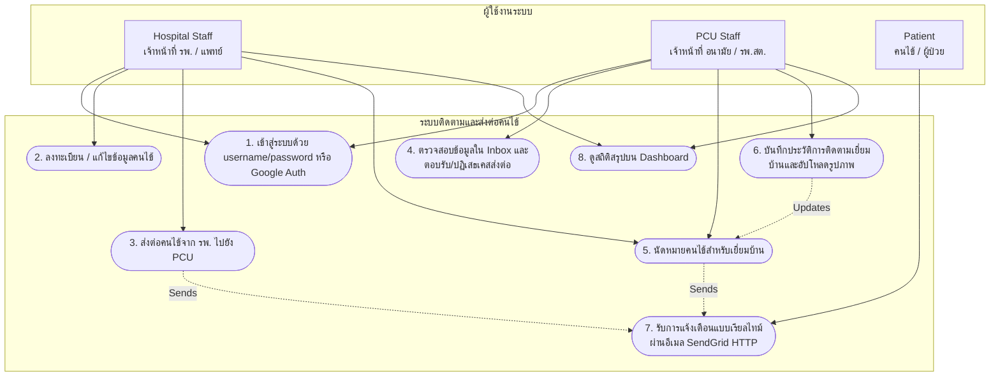
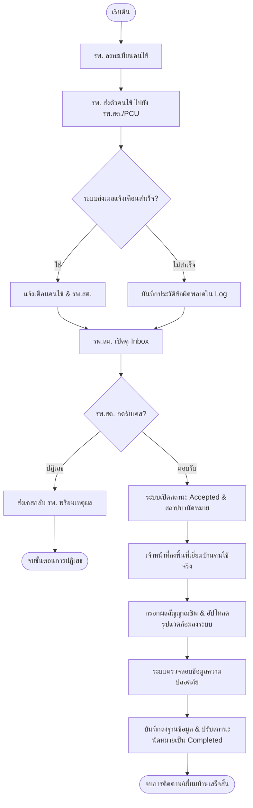
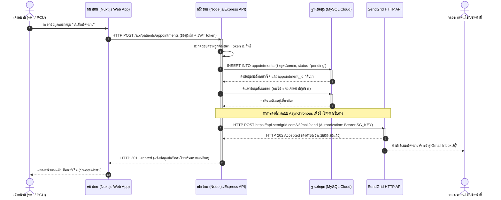

# คู่มือวิเคราะห์และออกแบบระบบ (Senior Project System Analysis & Design Guide)
> [!NOTE]
> เอกสารฉบับนี้จัดทำขึ้นเพื่อสำหรับนำไปใช้ประกอบรายงานความก้าวหน้าโครงการฝึกงาน หรือเล่มวิจัยจบการศึกษา (Senior Project) ปีที่ 4 โดยอิงตามระบบจริงของ **Patient Tracking System (ระบบติดตามและส่งต่อคนไข้)** ที่ได้รับการพัฒนาในองค์กร

---

## 1. Use Case Diagram (แผนภาพการใช้งานระบบ)
แผนภาพ Use Case แสดงผู้ใช้งานหลัก (**Actors**) และความสามารถของระบบ (**Use Cases**) ที่ออกแบบตามฟังก์ชันการทำงานจริง

---

## 2. Use Case Scenario / Specification (ตารางอธิบายรายละเอียด)
คำอธิบายขั้นตอนการทำงานอย่างเป็นระบบ (Scenario) ของ 3 ระบบหลักตามขอบเขตงาน

### UC-01: ระบบลงทะเบียนคนไข้ใหม่ (Patient Registration System)
| หัวข้อ | รายละเอียด |
| :--- | :--- |
| **รหัส Use Case** | UC-01 |
| **ชื่อ Use Case** | การลงทะเบียนข้อมูลคนไข้ใหม่ (Patient Registration) |
| **Actor หลัก** | Hospital Staff (เจ้าหน้าที่ รพ.) / PCU Staff (เจ้าหน้าที่ รพ.สต.) |
| **คำอธิบาย** | เจ้าหน้าที่กรอกข้อมูลส่วนตัวของคนไข้เข้าระบบ โดยต้องระบุข้อมูลสำคัญให้ครบถ้วนจึงจะบันทึกสำเร็จ |
| **เงื่อนไขก่อนหน้า (Pre-conditions)** | 1. เจ้าหน้าที่ล็อกอินเข้าสู่ระบบเรียบร้อยแล้ว 2. เจ้าหน้าที่มีสิทธิ์ในการสร้าง/แก้ไขประวัติผู้ป่วย |
| **เงื่อนไขหลังจบ (Post-conditions)** | 1. ระบบบันทึกข้อมูลผู้ป่วยใหม่ลงตาราง `patient` 2. ข้อมูลกลุ่มโรคประจำตัวจับคู่ลงตาราง `patient_disease_groups` เพื่อใช้คัดกรองความเสี่ยง |
| **ขั้นตอนการทำงานหลัก (Main Flow)** | 1. เจ้าหน้าที่เลือกเมนู "ลงทะเบียนคนไข้ใหม่" บนระบบหน้าบ้าน 2. เจ้าหน้าที่ต้องระบุข้อมูลทุกฟิลด์ให้ครบถ้วน ได้แก่: &nbsp;&nbsp;&nbsp;&nbsp;- เลขบัตรประชาชน (CID) 13 หลัก &nbsp;&nbsp;&nbsp;&nbsp;- ชื่อจริง และ นามสกุล &nbsp;&nbsp;&nbsp;&nbsp;- วัน/เดือน/ปีเกิด &nbsp;&nbsp;&nbsp;&nbsp;- เพศ &nbsp;&nbsp;&nbsp;&nbsp;- เบอร์โทรศัพท์ &nbsp;&nbsp;&nbsp;&nbsp;- อีเมลแจ้งเตือน (รูปแบบถูกต้อง) &nbsp;&nbsp;&nbsp;&nbsp;- ที่อยู่โดยละเอียดสำหรับการเยี่ยมบ้าน &nbsp;&nbsp;&nbsp;&nbsp;- กลุ่มโรคประจำตัวอย่างน้อย 1 กลุ่มโรค 3. เจ้าหน้าที่ตรวจสอบความถูกต้องและกดปุ่ม "บันทึกข้อมูล" 4. ระบบหน้าบ้านและระบบหลังบ้านทำการตรวจสอบ (Validate) ทุกช่องข้อมูลตามเงื่อนไขที่กำหนด 5. ระบบตรวจสอบว่าเลขบัตรประชาชน (CID) หรือเลข HN ซ้ำกับคนไข้รายอื่นในระบบหรือไม่ 6. ระบบรัน Database Transaction เพื่อบันทึกข้อมูลตาราง `patient` และตาราง `patient_disease_groups` 7. หน้าจอแจ้งเตือนข้อความสำเร็จ "ลงทะเบียนผู้ป่วยสำเร็จ" และแสดงเลข HN ที่สร้างขึ้นใหม่ |
| **ขั้นตอนสลับ (Alternative Flow)** | **[กรณีข้อมูลสำคัญไม่ครบถ้วนหรือรูปแบบไม่ถูกต้อง]** 4a. หากตรวจพบว่าฟิลด์ใดฟิลด์หนึ่งว่างเปล่า หรือรูปแบบอีเมลไม่ถูกต้อง ระบบหลังบ้านจะปฏิเสธการบันทึก (Return HTTP 400 Bad Request) และแสดงแจ้งเตือนฟิลด์ที่ต้องการแก้ไข **[กรณีเลขบัตรประชาชน (CID) ซ้ำซ้อน]** 5a. หากตรวจพบว่ามี CID นี้ในฐานข้อมูลแล้ว ระบบจะยกเลิก Transaction (Return HTTP 409 Conflict) และแจ้งเตือนข้อผิดพลาดบัตรประชาชนซ้ำ |

---

### UC-02: ระบบนัดหมายเยี่ยมบ้าน (Appointment Scheduling System)
| หัวข้อ | รายละเอียด |
| :--- | :--- |
| **รหัส Use Case** | UC-02 |
| **ชื่อ Use Case** | การนัดหมายเพื่อเยี่ยมบ้านและติดตามอาการ (Appointment Scheduling) |
| **Actor หลัก** | Hospital Staff (เจ้าหน้าที่ รพ.) / PCU Staff (เจ้าหน้าที่ รพ.สต.) |
| **คำอธิบาย** | เจ้าหน้าที่นัดหมายวัน เวลา และกำหนดเหตุผลในการลงพื้นที่ตรวจสุขภาพหรือเยี่ยมบ้านคนไข้ |
| **เงื่อนไขก่อนหน้า (Pre-conditions)** | 1. คนไข้ได้รับการลงทะเบียนเข้าระบบเป็นที่เรียบร้อยแล้ว |
| **เงื่อนไขหลังจบ (Post-conditions)** | 1. ระบบบันทึกข้อมูลงตาราง `appointments` ในสถานะรอนัดหมาย (`pending`)  2. ระบบส่งอีเมลแจ้งเตือนนัดหมายไปยังผู้ป่วยและเจ้าหน้าที่ผู้ดูแลโดยอัตโนมัติ |
| **ขั้นตอนการทำงานหลัก (Main Flow)** | 1. เจ้าหน้าที่เปิดหน้าข้อมูลคนไข้ที่ต้องการนัดหมาย 2. เจ้าหน้าที่เลือกเมนู "สร้างนัดหมาย" 3. เจ้าหน้าที่กรอกข้อมูล: วันและเวลานัดหมาย, แพทย์/เจ้าหน้าที่ผู้รับผิดชอบนัดหมาย, และรายละเอียดวัตถุประสงค์ในการเข้าเยี่ยม 4. เจ้าหน้าที่กดปุ่ม "บันทึกนัดหมาย" 5. ระบบตรวจสอบข้อมูลและทำการเขียนบันทึกลงตาราง `appointments` ในรูปแบบสถานะ `pending` 6. หลังการบันทึกสำเร็จ ระบบดึงข้อมูลอีเมลผู้เกี่ยวข้องและยิง HTTP Request ไปยัง SendGrid API เพื่อส่งอีเมลนัดหมายอัตโนมัติ 7. หน้าจอปรากฏหน้าต่างแจ้งเตือนสำเร็จ |
| **ขั้นตอนสลับ (Alternative Flow)** | **[กรณีเลือกวันนัดหมายย้อนหลัง]** 3a. ระบบตรวจสอบพบว่าวันนัดหมายมีค่าน้อยกว่าวันเวลาปัจจุบัน จะแสดงหน้าจอแจ้งเตือนความผิดพลาด และไม่อนุญาตให้ผ่านขั้นตอนบันทึก |

---

### UC-03: ระบบส่งต่อและติดตาม (Referral and Tracking System)
| หัวข้อ | รายละเอียด |
| :--- | :--- |
| **รหัส Use Case** | UC-03 |
| **ชื่อ Use Case** | การส่งต่อผู้ป่วยและติดตามประเมินผลเยี่ยมบ้าน (Patient Referral & Tracking) |
| **Actor หลัก** | Hospital Staff (เจ้าหน้าที่ รพ. ผู้ส่งต่อ) / PCU Staff (เจ้าหน้าที่ รพ.สต. ผู้รับและติดตาม) |
| **คำอธิบาย** | กระบวนการส่งต่อผู้ป่วยพ้นระยะวิกฤตจาก รพ. ไปให้ รพ.สต.ดูแลต่อ โดย รพ.สต.จะรับเคสและบันทึกประวัติสัญญาณชีพที่ได้จากการลงเยี่ยมบ้าน |
| **เงื่อนไขก่อนหน้า (Pre-conditions)** | 1. ผู้ป่วยได้รับการจดทะเบียนในระบบ 2. ได้รับการวินิจฉัยและมีคำสั่งส่งต่อการดูแลสุขภาพ |
| **เงื่อนไขหลังจบ (Post-conditions)** | 1. สถานะใบส่งต่อ (`referral`) และนัดหมาย (`appointments`) ได้รับการปรับเป็น `completed` 2. บันทึกผลวัดสุขภาพลงตาราง `tracking` และรูปถ่ายแนบลงตาราง `image` เรียบร้อย |
| **ขั้นตอนการทำงานหลัก (Main Flow)** | 1. **[รพ. ส่งตัว]**: เจ้าหน้าที่ รพ. สร้างเคสส่งตัวผู้ป่วย ➡️ เลือก รพ.สต. ปลายทางระบุความเร่งด่วน ➡️ บันทึกข้อมูลและส่งอีเมลแจ้งอนามัยปลายทางอัตโนมัติ 2. **[รพ.สต. ตอบรับ]**: เจ้าหน้าที่ รพ.สต. ตรวจสอบรายละเอียดใน Inbox และกดยอมรับ (Accept) ➡️ ระบบสร้างประวัตินัดหมายอ้างอิงอัตโนมัติ 3. **[รพ.สต. บันทึกติดตาม]**: เมื่อเจ้าหน้าที่เดินทางไปตรวจคนไข้จริงเสร็จ จะมาเปิดหน้าต่าง "บันทึกผลการติดตาม" ➡️ ระบุสัญญาณชีพ (ความดันโลหิต SYS/DIA, ค่าน้ำตาล DTX, น้ำหนักตัว, อาการ และปัญหาสภาพแวดล้อมพร้อมแนบภาพถ่าย) 4. เจ้าหน้าที่กดบันทึกผลการเยี่ยมบ้าน 5. ระบบใช้ Transaction ทำการบันทึกตาราง `tracking` และ `image` พร้อมเปลี่ยนสถานะนัดหมายและใบส่งต่อเดิมให้กลายเป็น `completed` ทันที 6. หน้าจอปรากฏแจ้งเตือนบันทึกผลสำเร็จ |
| **ขั้นตอนสลับ (Alternative Flow)** | **[กรณีปฏิเสธเคสส่งต่อ]** 2a. หากตรวจสอบพบว่าผู้ป่วยไม่ได้อยู่ในเขตรับผิดชอบของอนามัยนั้น เจ้าหน้าที่ รพ.สต. กด "ปฏิเสธ" (Reject) พร้อมบันทึกเหตุผล ➡️ ระบบส่งอีเมลแจ้งกลับไปที่ รพ. เพื่อหาแนวทางส่งตัวต่อที่อื่น **[กรณีพบสัญญาณชีพเสี่ยงอันตราย]** 5a. หากข้อมูลความดันโลหิตหรือน้ำตาลอยู่ในเกณฑ์วิกฤต (Critical) ระบบจะขึ้นป๊อปอัปแจ้งเตือนให้เจ้าหน้าที่ประสานงานเพื่อส่งตัวผู้ป่วยกลับโรงพยาบาลใหญ่อย่างเร่งด่วน |

---

## 3. Flow Chart (แผนผังลำดับขั้นตอนการทำงาน / Workflow)
แผนภูมิแสดง Flow การทำงานเชิงธุรกิจของกระบวนการส่งต่อและการติดตามเยี่ยมนัดหมายตั้งแต่ต้นจนจบกระบวนการ

---

## 4. Sequence Diagram (แผนภาพลำดับขั้นการทำงาน)
แสดงการแลกเปลี่ยนข้อมูลระหว่างส่วนประกอบต่างๆ ในระบบจริง เช่น การสร้างนัดหมายและการทำงานร่วมกับบริการภายนอก (SendGrid) ผ่าน HTTP Request

---

## 5. ER Diagram (Entity-Relationship Diagram)
โครงสร้างความสัมพันธ์ระหว่างข้อมูลในฐานข้อมูล MySQL จริงของระบบ โดยระบุ Primary Key (PK) และ Foreign Key (FK) ตามที่ใช้จริงในสถาปัตยกรรมระบบ

---

## 6. Data Dictionary (พจนานุกรมข้อมูล)
โครงสร้างฟิลด์ข้อมูลอย่างละเอียดของตารางที่สำคัญ เพื่อสำหรับใส่ในเอกสารบทที่ 3 ของเล่มรายงาน

### ตารางที่ 1: `patient` (ข้อมูลคนไข้)
เก็บรายละเอียดประวัติข้อมูลส่วนตัวของคนไข้ที่รับการส่งตัวหรือนัดหมาย

| ชื่อคอลัมน์ (Column Name) | ประเภทข้อมูล (Data Type) | คีย์หลัก/นอก (Key) | ค่าว่างได้ไหม (Null) | คำอธิบาย (Description) |
| :--- | :--- | :---: | :---: | :--- |
| `id` | INT AUTO_INCREMENT | PK | NO | ไอดีอ้างอิงลำดับของข้อมูลผู้ป่วย |
| `service_unit_id` | INT | FK | NO | อ้างอิงหน่วยบริการที่จดทะเบียนแรกรับ (`service_unit.id`) |
| `hn_number` | VARCHAR(50) | UK | NO | หมายเลขประจำตัวผู้ป่วยของโรงพยาบาล (HN Number) |
| `cid` | VARCHAR(13) | UK | NO | เลขประจำตัวประชาชน 13 หลักของผู้ป่วย |
| `first_name` | VARCHAR(100) | - | NO | ชื่อจริงของผู้ป่วย (ภาษาไทย) |
| `last_name` | VARCHAR(100) | - | NO | นามสกุลของผู้ป่วย (ภาษาไทย) |
| `date_of_birth` | DATE | - | NO | วัน/เดือน/ปี เกิดของผู้ป่วย |
| `gender` | VARCHAR(10) | - | NO | เพศของผู้ป่วย (ชาย, หญิง, อื่นๆ) |
| `phone` | VARCHAR(20) | - | YES | เบอร์โทรศัพท์ติดต่อของผู้ป่วยหรือญาติ |
| `email` | VARCHAR(255) | - | YES | อีเมลสำหรับใช้ในการส่งแจ้งเตือนนัดหมายและส่งตัว |
| `address` | TEXT | - | YES | ที่อยู่ปัจจุบันสำหรับการลงพื้นที่เยี่ยมบ้าน |

---

### ตารางที่ 2: `referral` (ประวัติการส่งต่อผู้ป่วย)
ใช้สำหรับบริหารจัดเก็บข้อมูลการส่งเคสจากโรงพยาบาลใหญ่ไปยัง รพ.สต./อนามัย

| ชื่อคอลัมน์ (Column Name) | ประเภทข้อมูล (Data Type) | คีย์หลัก/นอก (Key) | ค่าว่างได้ไหม (Null) | คำอธิบาย (Description) |
| :--- | :--- | :---: | :---: | :--- |
| `id` | INT AUTO_INCREMENT | PK | NO | ไอดีอ้างอิงลำดับของข้อมูลส่งตัว |
| `patient_id` | INT | FK | NO | ผู้ป่วยที่ต้องการส่งตัว (`patient.id`) |
| `appointment_id` | INT | FK | YES | ลิงก์เชื่อมการนัดหมายที่สร้างขึ้นเพื่อรับงานส่งต่อ |
| `from_service_unit_id`| INT | FK | NO | หน่วยงานผู้ส่งต้นทาง (`service_unit.id`) |
| `to_service_unit_id` | INT | FK | NO | หน่วยงานผู้รับปลายทาง (`service_unit.id`) |
| `referred_by_user_id`| INT | FK | NO | แพทย์หรือเจ้าหน้าที่ผู้กดส่งเคส (`user.id`) |
| `receiver_user_id` | INT | FK | YES | เจ้าหน้าที่ อนามัยที่กดรับเคสที่ส่งมา (`user.id`) |
| `referral_date` | DATETIME | - | NO | วันและเวลาที่ลงบันทึกส่งเคสออก |
| `received_at` | DATETIME | - | YES | วันและเวลาที่เจ้าหน้าที่ปลายทางกดตอบรับเคส |
| `reason` | TEXT | - | YES | เหตุผลทางการแพทย์หรืออาการทางคลินิกของการส่งตัว |
| `urgency_level` | VARCHAR(20) | - | NO | ระดับความเร่งด่วน (`low`, `medium`, `high`, `critical`) |
| `status` | VARCHAR(20) | - | NO | สถานะการส่งตัว (`pending`, `accepted`, `rejected`, `completed`) |
| `reject_reason` | TEXT | - | YES | เหตุผลในกรณีที่ปลายทางปฏิเสธเคส |

---

### ตารางที่ 3: `tracking` (ประวัติการเยี่ยมบ้าน/ติดตามคนไข้)
เก็บข้อมูลผลการตรวจประเมินระดับสัญญาณชีพและประวัติทางสุขภาพเมื่อไปติดตามคนไข้

| ชื่อคอลัมน์ (Column Name) | ประเภทข้อมูล (Data Type) | คีย์หลัก/นอก (Key) | ค่าว่างได้ไหม (Null) | คำอธิบาย (Description) |
| :--- | :--- | :---: | :---: | :--- |
| `id` | INT AUTO_INCREMENT | PK | NO | ไอดีอ้างอิงของใบประเมินการเยี่ยมบ้าน |
| `patient_id` | INT | FK | NO | รหัสคนไข้ที่ได้รับการติดตามประเมินผล (`patient.id`) |
| `appointment_id` | INT | FK | YES | อ้างอิงรอบการนัดหมายเยี่ยมบ้าน (`appointments.id`) |
| `tracked_by_user_id` | INT | FK | NO | เจ้าหน้าที่ผู้เดินทางไปเยี่ยมบ้านและตรวจวัด (`user.id`) |
| `tracking_date` | DATETIME | - | NO | วันและเวลาที่ลงพื้นที่เยี่ยมบ้านจริง |
| `symptoms_detail` | TEXT | - | YES | รายละเอียดอาการแสดงและสุขภาพทางคลินิกทั่วไป |
| `health_status` | VARCHAR(20) | - | NO | การจำแนกความเสี่ยงของคนไข้ (`normal`, `warning`, `critical`) |
| `bp_sys` | INT | - | YES | ค่าความดันตัวบน (Systolic Blood Pressure) มิลลิเมตรปรอท |
| `bp_dia` | INT | - | YES | ค่าความดันตัวล่าง (Diastolic Blood Pressure) มิลลิเมตรปรอท |
| `sugar` | INT | - | YES | ค่าน้ำตาลในเลือดจากปลายนิ้ว (DTX/Sugar) มิลลิกรัม/เดซิลิตร |
| `weight` | DECIMAL(5,2) | - | YES | น้ำหนักตัวปัจจุบันของผู้ป่วย (กิโลกรัม) |
| `problems` | TEXT | - | YES | ปัญหาและอุปสรรคที่พบเจอ เช่น สภาพจิตใจ สภาพแวดล้อม |
| `advice` | TEXT | - | YES | คำแนะนำทางการพยาบาลหรือการกินยาที่มอบให้คนไข้ |
| `location` | VARCHAR(255) | - | YES | พิกัดหรือตำแหน่งที่อยู่อ้างอิงในการเยี่ยม |
| `next_appointment_date`| DATETIME | - | YES | กำหนดวันนัดหมายเพื่อเดินทางมาเยี่ยมในรอบถัดไป |

---

### ตารางที่ 4: `appointments` (การนัดหมายของคนไข้)
เก็บข้อมูลปฏิทินนัดหมายในการเยี่ยมหรือรับบริการ

| ชื่อคอลัมน์ (Column Name) | ประเภทข้อมูล (Data Type) | คีย์หลัก/นอก (Key) | ค่าว่างได้ไหม (Null) | คำอธิบาย (Description) |
| :--- | :--- | :---: | :---: | :--- |
| `id` | INT AUTO_INCREMENT | PK | NO | ไอดีรหัสการนัดหมาย |
| `patient_id` | INT | FK | NO | ลิงก์ไปยังข้อมูลผู้ป่วยที่มีการนัดหมาย (`patient.id`) |
| `doctor_id` | INT | FK | NO | เจ้าหน้าที่ที่ได้รับมอบหมายให้ออกตรวจตามนัด (`user.id`) |
| `appointment_date` | DATETIME | - | NO | วันที่และเวลาที่นัดหมายทำการตรวจ |
| `reason` | TEXT | - | YES | วัตถุประสงค์หรือประเด็นที่นัดเพื่อตรวจประเมิน |
| `status` | VARCHAR(20) | - | NO | สถานะการนัดหมาย (`pending`, `completed`, `missed`, `cancelled`) |

---

### ตารางที่ 5: `user` (ผู้ใช้ระบบ/เจ้าหน้าที่ปฏิบัติงาน)
จัดเก็บรายละเอียดโปรไฟล์และสิทธิ์การทำงานของบุคลากรทางการแพทย์ในระบบ

| ชื่อคอลัมน์ (Column Name) | ประเภทข้อมูล (Data Type) | คีย์หลัก/นอก (Key) | ค่าว่างได้ไหม (Null) | คำอธิบาย (Description) |
| :--- | :--- | :---: | :---: | :--- |
| `id` | INT AUTO_INCREMENT | PK | NO | ไอดีสำหรับอ้างอิงตัวบุคคลของเจ้าหน้าที่ |
| `username` | VARCHAR(100) | UK | NO | บัญชีผู้ใช้งานระบบ (Unique Username) |
| `password_hash` | VARCHAR(255) | - | NO | รหัสผ่านที่ได้รับการเข้ารหัสความปลอดภัยด้วย bcrypt |
| `first_name` | VARCHAR(100) | - | NO | ชื่อจริงของเจ้าหน้าที่สาธารณสุข |
| `last_name` | VARCHAR(100) | - | NO | นามสกุลของเจ้าหน้าที่สาธารณสุข |
| `role` | VARCHAR(50) | - | NO | ระดับสิทธิ์ทำงาน (`admin`, `manager`, `hospital_staff`, `pcu_staff`) |
| `service_unit_id` | INT | FK | YES | หน่วยบริการทางการแพทย์ที่สังกัดทำงานอยู่ (`service_unit.id`) |
| `email` | VARCHAR(255) | - | YES | อีเมลติดต่อสำหรับการรับแจ้งเตือนระบบงานส่งตัวนัดหมาย |
